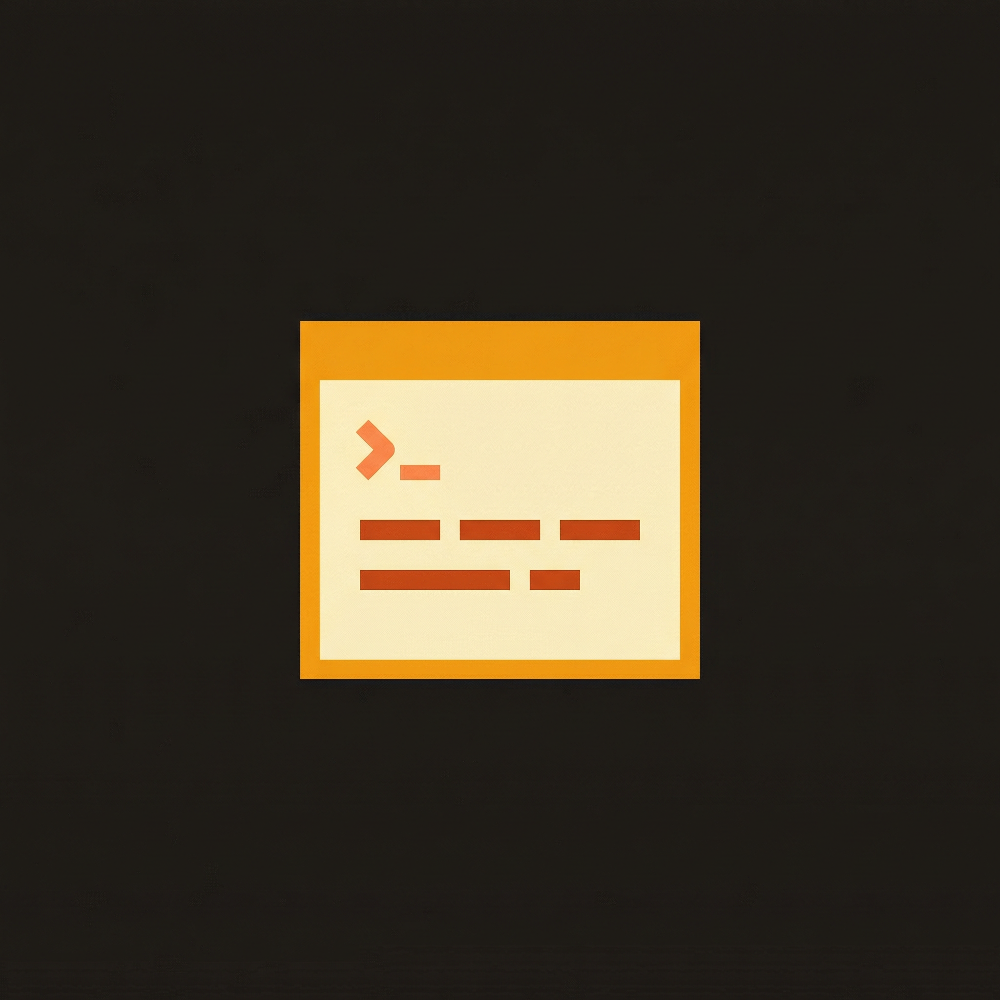

# PyTUI

<p align="center">
  
</p>

<p align="center">
  <strong>Terminal UI framework for Python.</strong> Flexbox layout, rich components, React-style declarative API, and optional Rust acceleration.
</p>

<p align="center">
  <a href="https://github.com/sst/opentui">OpenTUI</a>-aligned architecture · Python 3.11+ · MIT
</p>

---

## Why PyTUI?

- **Terminal-first.** No browser, no Electron—just your shell. Build dashboards, CLIs, and interactive tools that feel native.
- **Dual API.** Go imperative (mount widgets, call methods) or declarative (`h("box", {}, ...)`, hooks, reconcile). Same runtime.
- **Layout that scales.** Yoga (via [poga](https://github.com/dzhsurf/poga)) or a built-in stub: flex direction, gap, padding, % sizing. No more manual `(x, y)` math.
- **Batteries included.** Text (wrap, styled, tabs), Box, Input, Select, TabSelect, Slider, Scrollbox, Code, Diff, LineNumber, FrameBuffer—plus inline spans (`<b>`, `<a>`, etc.) for rich text.
- **Optional speed.** Pure Python by default; plug in the Rust extension (`pytui_native`) for buffer/ANSI/grapheme hot paths when you need it.

---

## Architecture (the 10,000-foot view)

```
┌─────────────────────────────────────────────────────────────────┐
│  Your app (imperative or React-style with h() + reconcile)      │
├─────────────────────────────────────────────────────────────────┤
│  components/   Text, Box, Input, Select, Slider, Scrollbox,      │
│                Code, Diff, TabSelect, LineNumber, FrameBuffer    │
├─────────────────────────────────────────────────────────────────┤
│  core/         Renderer, Renderable tree, layout (Yoga/stub),    │
│                buffer, terminal, keyboard, mouse, edit_buffer    │
├─────────────────────────────────────────────────────────────────┤
│  lib/          RGBA, key_handler, styled_text, selection,       │
│                stdin_buffer, parse_mouse, tree_sitter, extmarks  │
├─────────────────────────────────────────────────────────────────┤
│  native/       Optional Rust: cell, buffer, ANSI, grapheme      │
└─────────────────────────────────────────────────────────────────┘
```

- **Layout:** Flexbox (row/column, justify, align, gap, flex-grow). Yoga via poga if installed; otherwise stub.
- **Render:** Dirty flag → `calculate_layout()` → `render(back_buffer)` → diff vs previous frame → ANSI output (no full redraw when unchanged).
- **Input:** Keyboard (Kitty CSI u, arrows, etc.) and SGR mouse; focus/blur so only focused widget gets keys.

---

## Features

### Core

| Area | What you get |
|------|----------------|
| **Buffer** | Double-buffered grid, alpha blending, `fill_rect`, `set_cell`, optional native backend |
| **Layout** | Yoga (poga) or stub: flex direction, justify/align, gap, padding, % width/height, absolute position |
| **Renderer** | Main loop: input → resize check → layout → render → diff → ANSI out |
| **Terminal** | Size, alternate screen, raw mode, cursor hide/show, mouse on/off |
| **Events** | pyee-based; `on("keypress" | "mouse" | "change" | …)` |

### Components

| Component | Description |
|-----------|-------------|
| **Text** | Plain or styled; wrap (word/char/none), truncate, tab indicator, `plain_text` / `line_count` / `virtual_line_count` |
| **Box** | Container; border, title, padding, gap, background; scissors for children |
| **Input** | Single-line text, placeholder, maxLength, submit on Enter |
| **Select** | List with keyboard nav, descriptions, scroll indicator, wrap selection |
| **TabSelect** | Horizontal tabs, arrows, optional description/underline |
| **Slider** | Horizontal/vertical, min/max/value, viewPortSize, half-block thumb (█▌▐), mouse drag |
| **Scrollbox** | Scrollable area; j/k or arrows, optional acceleration |
| **ScrollBar** | Standalone scrollbar (track + thumb) |
| **Textarea** | Multi-line edit with EditBuffer, cursor, selection |
| **Code** | Syntax-highlighted block (tree-sitter optional) |
| **Diff** | Unified/split diff view |
| **LineNumber** | Gutter with line numbers and signs |
| **FrameBuffer** | Offscreen buffer; blit to parent with alpha |
| **TextNode / Span** | Inline rich text: `<b>`, `<i>`, `<a href="...">`, line breaks |

### React-style API

- **`h(type, props, *children)`** — Virtual nodes: `"text"`, `"box"`, `"input"`, `"select"`, `"slider"`, `"scrollbox"`, etc., or Component classes.
- **`reconcile(elements, container)`** — Mount/update the tree into a renderable container.
- **Hooks:** `useState`, `useEffect`, `useRenderer`, `useResize`, `useKeyboard`, `useEvent`.
- **Inline elements:** `<span>`, `<b>`, `<i>`, `<u>`, `<a href="...">`, `<br/>` inside `<text>`.

### Lib (shared primitives)

- **Colors:** RGBA, `parse_color`, `parse_color_to_tuple`; terminal palette detection.
- **Input:** KeyHandler (Kitty + common escapes), parse_mouse (SGR), stdin_buffer (escape parsing, paste, timeout flush).
- **Text:** styled_text, selection, tree_sitter + tree_sitter_styled_text (optional).
- **Misc:** scroll_acceleration, extmarks, keymapping, debounce, queue, data_paths.

### Optional

- **Yoga layout:** `pip install poga` (or `.[yoga]`) for full flex layout.
- **Syntax:** `pip install tree-sitter tree-sitter-languages` (or `.[syntax]`) for Code/Diff highlighting.
- **Rust extension:** `cd src/pytui/native && maturin develop` for native buffer/ANSI/grapheme.

---

## Setup

```bash
cd pytui
pip install -e ".[dev]"

# Optional: Yoga layout
pip install -e ".[yoga]"
# or: pip install poga

# Optional: Rust extension
cd src/pytui/native && maturin develop && cd ../../..
```

---

## Examples

**Launcher (pick one from the list):**

```bash
python -m pytui.examples
# or run by name:
python -m pytui.examples simple-layout
python -m pytui.examples input-demo
python -m pytui.examples slider-demo
python -m pytui.examples text-wrap
python -m pytui.examples text-node-demo
python -m pytui.examples nested-zindex-demo
```

**Available demos (see `src/pytui/examples/registry.py`):**

- `simple-layout` — Flex layout (row/column/center), Space to cycle, R reset.
- `input-demo` — Multiple inputs, Tab, validation, Enter submit.
- `input-select-layout` — Input + Select on one screen.
- `select-demo` — List with F/D/S/W toggles, descriptions.
- `tab-select-demo` — Tab strip with arrows and options.
- `slider-demo` — Horizontal/vertical sliders, F to switch focus.
- `styled-text-demo` — Colors and formatting.
- `text-node-demo` — TextNode API (basic, nested, dynamic).
- `text-wrap` — ScrollBox + word wrap, j/k scroll, L load file.
- `link-demo` — OSC 8 hyperlinks.
- `opacity-example` — Box opacity, 1–4 toggle, A animate.
- `nested-zindex-demo` — Z-order and overlapping boxes.
- `relative-positioning-demo` — Relative/absolute positioning.

**Declarative (React-style) examples** (separate scripts, e.g. `hello_react.py`, `counter_react.py`, `todo_react.py`) use `h()` + `reconcile()` + hooks; see `docs/architecture.md` and the react catalogue.

---

## Tests & quality

```bash
# Unit + integration
pytest tests/unit/ tests/integration/ -v

# With coverage (e.g. ≥70%)
pytest tests/ --cov=src/pytui --cov-report=term-missing --cov-fail-under=70

# Benchmarks
pytest tests/benchmarks/ --benchmark-only

# Lint & format
ruff check src/ && ruff format src/
```

CI (GitHub Actions) runs on push/PR: ruff, pytest, coverage.

---

## Docs

| Doc | Contents |
|-----|----------|
| [Getting Started](docs/getting-started.md) | First steps and run loop |
| [Architecture](docs/architecture.md) | Render flow, layout, React API, input |
| [API Reference](docs/api-reference.md) | Public APIs |
| [OpenTUI vs PyTUI](docs/opentui-pytui-comparison.md) | Alignment and differences |
| [AGENTS.md](AGENTS.md) | Guide for AI agents and contributors |

---

## Roadmap & alignment

PyTUI follows the [OpenTUI](https://github.com/sst/opentui) architecture (Option A). Phases and milestones are in [IMPLEMENTATION_PLAN.md](IMPLEMENTATION_PLAN.md). Components and APIs are aligned where applicable (e.g. Text wrapMode/truncate, Slider getVirtualThumbSize/getThumbRect, Box gap, React-style h/reconcile).

---

## License

MIT.
